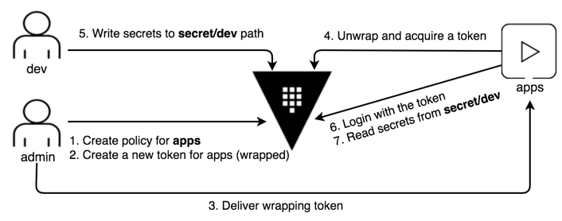

Think of a scenario where apps read secrets from Vault. The apps need:

- Policy granting "read" permission on the specific path (`secret/dev`)
- Valid tokens to interact with Vault
- More privileged token (e.g. admin) wraps a secret only the expecting client can read
- The receiving client (an app) unwraps the secret to obtain the token



When the response to vault token create request is wrapped, Vault inserts the
generated token into the cubbyhole of a single-use token, returning that
single-use wrapping token. Retrieving the secret requires an unwrap operation
against this wrapping token.


## Create a New Token for Apps

A policy file is provided (`apps-policy.hcl`).

```
docker cp apps-policy.hcl vault:/apps-policy.hcl
clear
cat apps-policy.hcl
```{{execute}}

Execute the following command to create a new policy named, `apps-policy`:

```
vault policy write apps-policy apps-policy.hcl
```{{execute}}

To create a token using response wrapping:

```
vault token create -policy=<POLICY_NAME> -wrap-ttl=<WRAP_TTL>
```

Execute the following commands to generate a token for apps using response wrapping with TTL of **360 seconds**.

```
vault token create -policy=apps -wrap-ttl=360 -format=json | jq -r ".auth.client_token" > wrapping-token.txt
```{{execute}}

> **NOTE:** The response is the **wrapping token** rather than the actual client token for apps-policy; therefore, the admin user does not even see the generated token.
