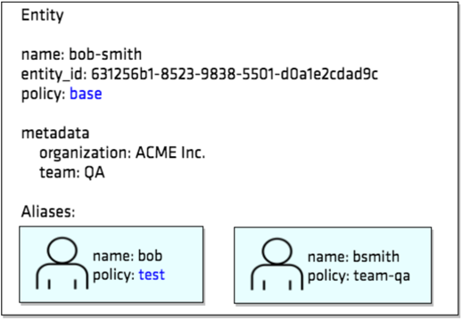

To better understand how a token inherits the capabilities from entity's policy, you are going to test it by logging in as bob.




Login as `bob`:

```
vault login -method=userpass username=bob \
     password=training
```{{execute}}


Remember that the `test` policy grants CRUD operations on the `secret/test` path.  Test to make sure that you can access the path.

```
vault kv put secret/test owner="bob"
```{{execute}}


Although the username `bob` does not have `base` policy attached, the token inherits the capabilities granted in the base policy because `bob` is a member of the `bob-smith` entity, and the entity has base policy attached.

Check to see that the bob's token inherited the capabilities.  

For example:

    $ vault token capabilities secret/training_test
    create, read

Remember that the base policy grants create and read capabilities on `secret/training_*` path.

### Question

What about the `secret/team/qa` path?

Does user `bob` have any permission on that path?


### Answer

The user bob only inherits capability from its associating entity's policy.  The base policy nor test policy grants permissions on the `secret/team/qa` path.  Only the `team-qa` policy does.

    $ vault token capabilities secret/team/qa
    deny

Therefore, the current token has no permission to access the `secret/team/qa` path.

### Step 7.2.4

Repeat the steps and login as a user, `bsmith`.  Test to see the token's capabilities.

### Step 7.2.5

Log back in with the root token.

    $ vault login root


## Task 3: Create an Internal Group

Now, you are going to create an internal group named, engineers.  Its member is `bob-smith` entity that you created in Task 1.

### Step 7.3.1

Let's first create a new policy so that you can test the capability inheritance.

Write a policy named, team-eng which grants CRUD operations on the `secret/team/eng` path.

`team-eng.hcl`

```text
path "secret/team/eng" {
   capabilities = [ "create", "read", "update", "delete" ]
}
```

Now, create `team-eng` policy:

    $ vault policy write team-eng ./team-eng.hcl

### Step 7.3.2

Execute the following command to create an internal group named, engineers and add `bob-smith` entity as a group member.  Also, assign the newly created `team-eng` policy to the group.

    $ vault write identity/group name="engineers" \
          policies="team-eng" \
          member_entity_ids=<entity_id> \
          metadata=team="Engineering" \
          metadata=region="North America"

Where `<entity_id>` is the value you copied at _Step 7.1.9_.

Example:

    $ vault write identity/group name="engineers" \
          policies="team-eng" \
          member_entity_ids="631256b1-8523-9838-5501..."  \
          metadata=team="Engineering" \
          metadata=region="North America"
    Key     Value
    ---     -----
    id      81bdac90-284a-7b8c-6289-5fa7693bcb4a
    name    engineers

Copy the generated group ID.

### Step 7.3.3

Read the details of the group, `qa-entineers`.

    $ vault read identity/group/id/<group_id>

Where `<group_id>` is the group ID from _Step 7.3.2_.

Example:

    Key                  Value
    ---                  -----
    alias                map[]
    creation_time        2018-02-14T22:29:51.324466238Z
    id                   81bdac90-284a-7b8c-6289-5fa7693bcb4a
    last_update_time     2018-02-14T22:29:51.324466238Z
    member_entity_ids    [631256b1-8523-9838-5501-d0a1e2cdad9c]
    member_group_ids     <nil>
    metadata             map[region:North America         
                              team:Engineering]
    modify_index         1
    name                 engineers
    policies             [team-eng]
    type                 internal


By default, Vault creates an internal group, and you don't create any alias for internal groups.  Group aliases are mapping between Vault and the external identity provider.  Therefore, you define group aliases when you create external groups.  For internal groups, you have `member_group_ids` and/or `member_group_ids` instead.


## Task 4: Test the Group

Now, test to understand how a token inherits the capabilities from its associating group.


### Step 7.4.1

Login as bob with userpass auth method:

    $ vault login -method=userpass username="bob" \
          password="training"

### Step 7.4.2

Test to see if the token has an access to the following paths:

`secret/test`
`secret/training_test`
`secret/team/qa`
`secret/team/eng`


## Challenge: Create an External Group and Group Alias

### Instructions
The most common use case is to create external groups each of those groups maps to an external group defined in a third-party identity provider (e.g. Active Directory, OpenLDAP, etc.).

>This challenge section requires a GitHub account with a team membership to perform.

Create an external group which maps to a GitHub team that your user account belongs to.  For example, if your GitHub username, `sammy22` which is a member of the `training` team in hashicorp organization.  Then, create an external group named, `education`, and a group alias named, `training` pointing to the GitHub auth backend (via github auth mount accessor).


To find out which GitHub team you belong to:

```bash
$ curl -H "Authorization: token <your_token>" \
      https://api.github.com/user/teams
```

While `<your_token>` is your GitHub API token.  If you do not have one, follow the [GitHub documentation](https://help.github.com/articles/creating-a-personal-access-token-for-the-command-line/) to create one.

The output should look like:

    [
      {
        "name": "Training",
        "id": 2074701,
        "slug": "training",
        "description": "Training stuff",
        "privacy": "closed",
        "url": "https://api.github.com/teams/2074701",
        ...
      }
    ]

**NOTE:** You want to use the slugified team name.

#### Hint:

- [Enable github auth method](https://www.vaultproject.io/intro/getting-started/authentication.html#auth-methods)
- Configure your GitHub team (`auth/github/map/teams/<team_name>` endpoint)
- [Create a new external group (`identity/group` endpoint)](https://www.vaultproject.io/api/secret/identity/group.html)
- [Create a group alias](https://www.vaultproject.io/api/secret/identity/group-alias.html) (to get the mount accessor for github, refer to _Step 7.1.8_)
